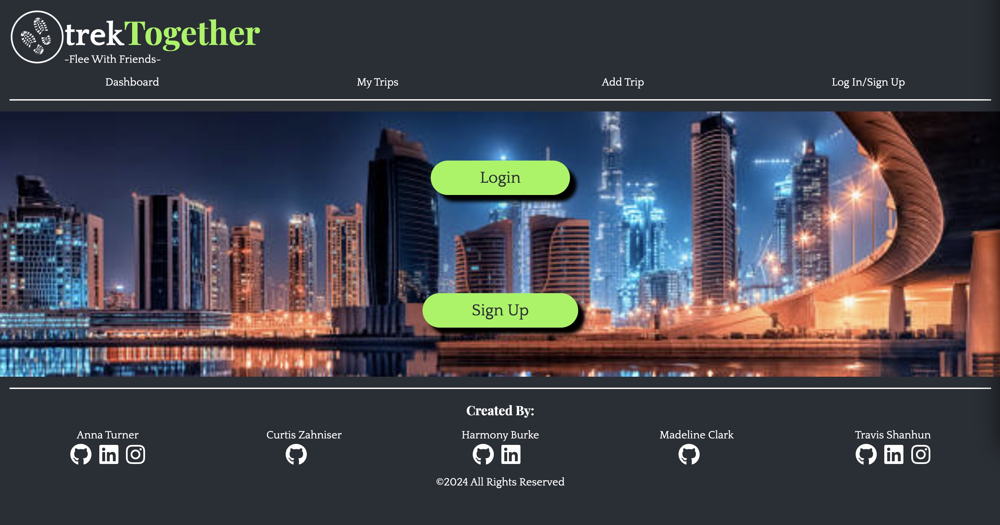
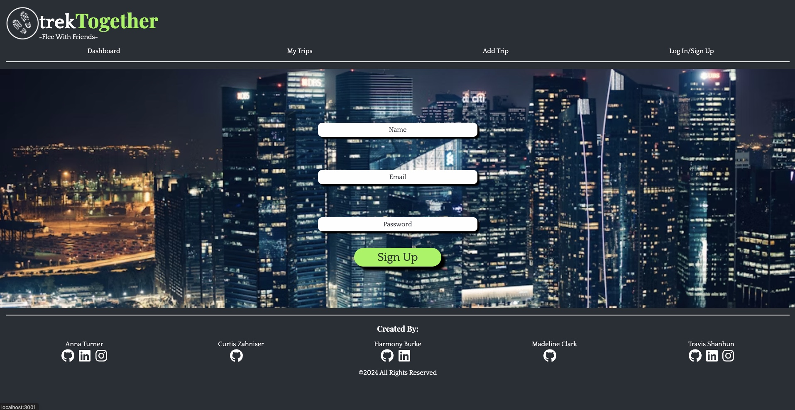
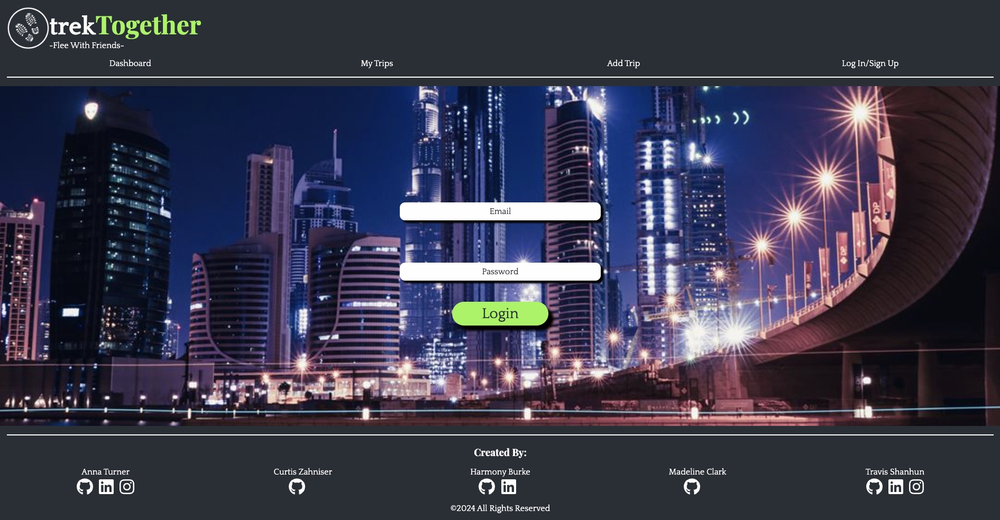
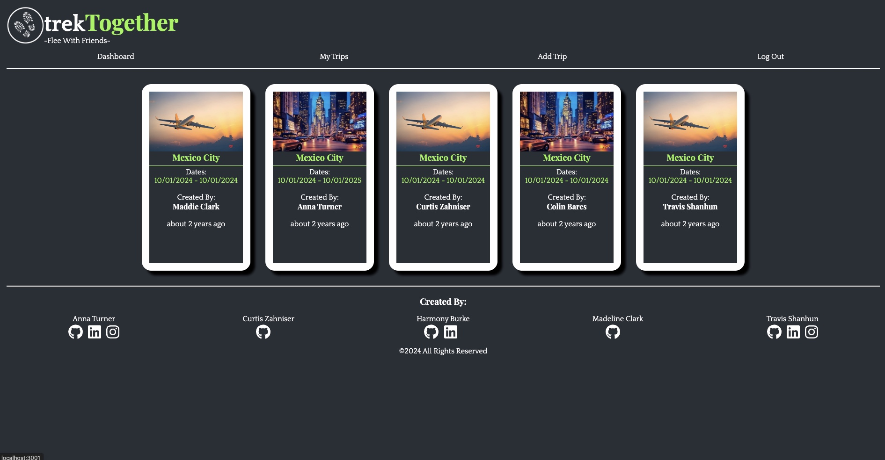
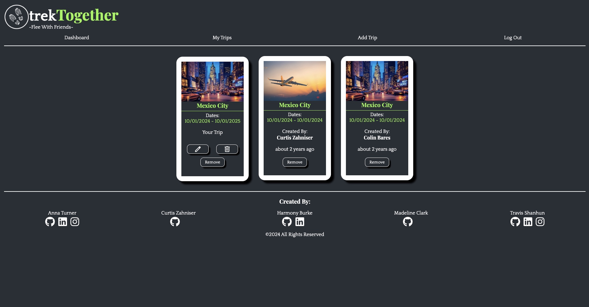
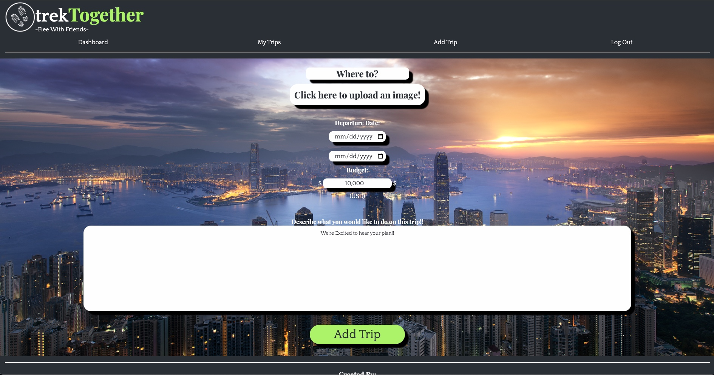
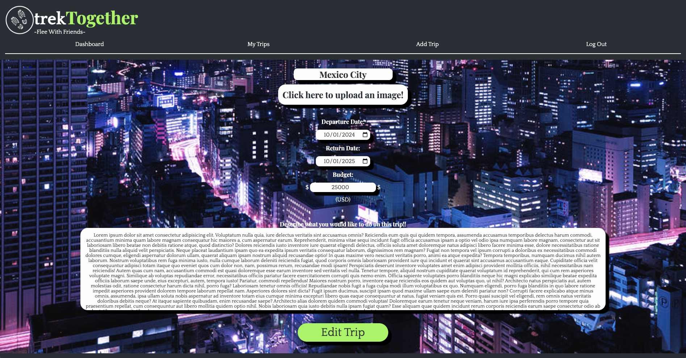
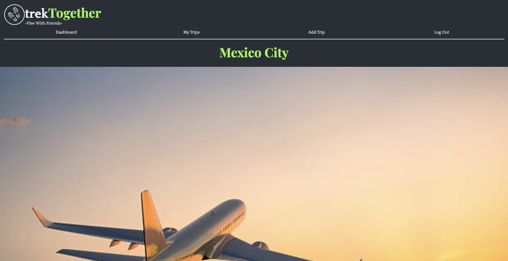
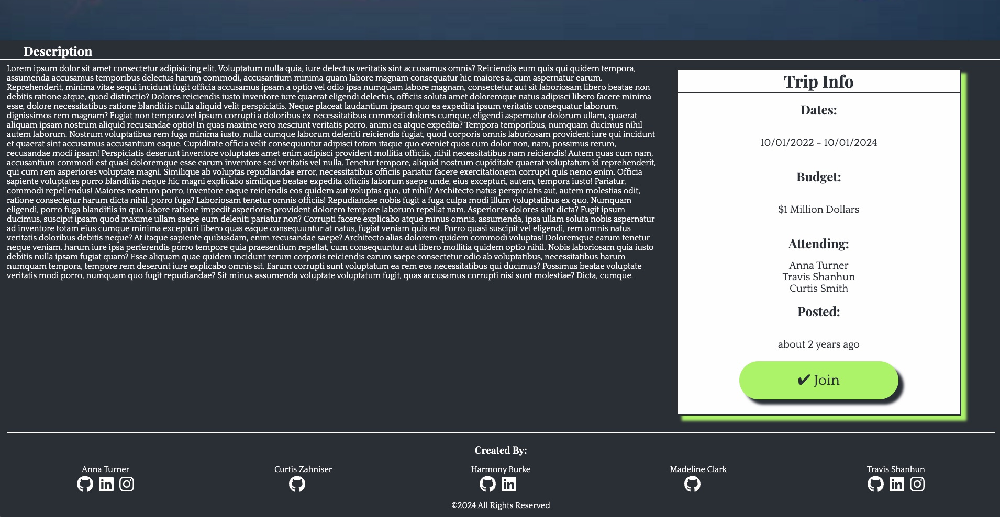

# trekTogether

### Table of Contents:

[Description](#description)

[Installation](#installation)

[Creator Information](#creator-information)

[Dependencies](#dependencies)

[Images of Site](#images-of-site)

[Link to Live Site](#link-to-live-site)

[Link to GitHub Repo](#link-to-github-repository)

[Credits](#credits)

[License](#license)

## Description:

This MERN stack application enables users to create profiles and log in. Upon logging in, users can view all previous trip ideas created by other users, excluding those with past departure dates. When a user selects a card on the dashboard, they are directed to a trip page displaying the full itinerary, destination, dates, attendees, and the option to join the trip. If a user joins a trip, it is added to their "My Trips" page.

In the "My Trips" section, users can view trips they have created and joined. Trips created by the user will display an edit button for making modifications. Users can also delete trips they have created or remove trips from other users on their "My Trips" page. Additionally, users can log out of their session when finished.

## Installation

To install this application please fork this repo. Then, run in terminal:

//~ npm init -y

//~ npm i

To run the application please run in terminal: 

//~ npm start

## Creator(s) Information

Please reach out to me if you have any further questions via:

<a href='https://github.com/AnnaT7459'> Anna Turner</a>

<a href='https://github.com/curtiszahniser'> Curtis Zahniser</a>

<a href='https://github.com/harmonyburke'> Harmony Burke</a>

<a href='https://github.com/madelineccstahl'> Madeline Clark</a>

<a href='https://github.com/RaszeroT'> Travis Shanhun</a>

Email: shanhun.codes@gmail.com

## Dependencies
### Client

 * @apollo/client@3.7.14
 * @fortawesome/free-brands-svg-icons@6.5.1
 * @fortawesome/react-fontawesome@0.2.0
 * @reduxjs/toolkit@2.2.1
 * datefns@3.3.1
 * react@18.2.0
 * react-dom@18.2.0
 * react-router-dom@6.22.2
 * vite@5.1.4
 * @vitejs/plugin-react@4.2.1
 * react-redux@9.1.0

## Images of Site:

## Link to Live Site:

<a href="https://trek-together-8c09e4cd8bba.herokuapp.com/">Deployed Application - Heroku</a>

## Credits:

* Max Mayfield - Instructor
* Andrew Hudgins - TA
* Colin Bares - TA
* Joshua Diehl - TA
* Ian Von Fange - TA

## License

MIT License

Copyright (c) 2024

Permission is hereby granted, free of charge, to any person obtaining a copy
of this software and associated documentation files (the "Software"), to deal
in the Software without restriction, including without limitation the rights
to use, copy, modify, merge, publish, distribute, sublicense, and/or sell
copies of the Software, and to permit persons to whom the Software is
furnished to do so, subject to the following conditions:

The above copyright notice and this permission notice shall be included in all
copies or substantial portions of the Software.

THE SOFTWARE IS PROVIDED "AS IS", WITHOUT WARRANTY OF ANY KIND, EXPRESS OR
IMPLIED, INCLUDING BUT NOT LIMITED TO THE WARRANTIES OF MERCHANTABILITY,
FITNESS FOR A PARTICULAR PURPOSE AND NONINFRINGEMENT. IN NO EVENT SHALL THE
AUTHORS OR COPYRIGHT HOLDERS BE LIABLE FOR ANY CLAIM, DAMAGES OR OTHER
LIABILITY, WHETHER IN AN ACTION OF CONTRACT, TORT OR OTHERWISE, ARISING FROM,
OUT OF OR IN CONNECTION WITH THE SOFTWARE OR THE USE OR OTHER DEALINGS IN THE
SOFTWARE.